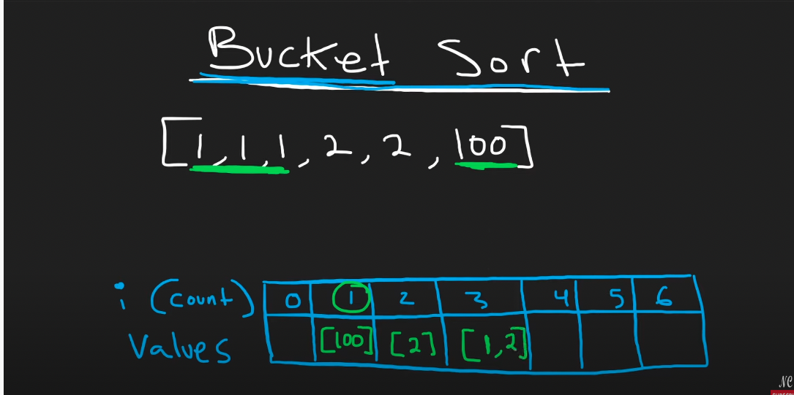
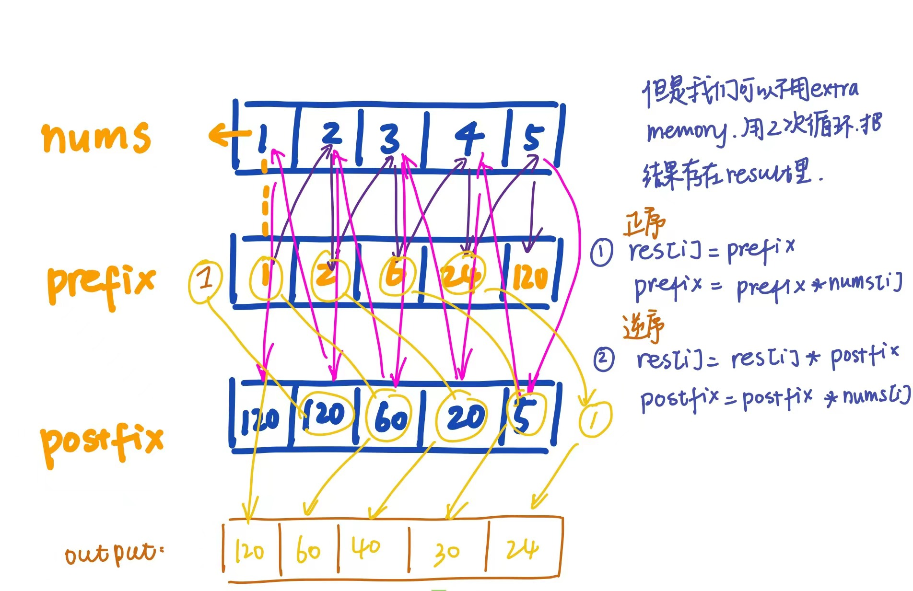

# 解题思路和笔记

## 242. Valid Anagram
### 注意：
* 这个不是反转列表！这个问题是rearrange
Given two strings s and t, return true if t is an anagram of s, and false otherwise.

An Anagram is a word or phrase formed by rearranging the letters of a different word or phrase, typically using all the original letters exactly once.


### 😍 Solution 1: Sort the two Strings.

``` Python
class Solution:
    def isAnagram(self, s: str, t: str) -> bool:
        if len(s) != len(t):
            return False
        return sorted(s) == sorted(t)
```

### 😍 Solution 2: Count the occurrence of characters (HashMap)

Time complexity O(s+t)

``` python
class Solution:
    def isAnagram(self, s: str, t: str) -> bool:
        if len(s) != len(t):
            return False
        
        countS, countT = {}, {}
        for i in range(len(s)):
            # avoid the keyvalue error
            countS[s[i]] = countS.get(s[i],0) + 1
            countT[t[i]] = countT.get(t[i],0) + 1
       
        for c in countS:
            if countS[c] != countT.get(c,0):
                return False
            
        return True
```

## Two sum
O(n) with HashMap
``` python
class Solution:
    def twoSum(self, nums: List[int], target: int) -> List[int]:
        prevMap = {} # val -> index
        
        for i, n in enumerate(nums):
            diff = target - n # check difference
            if diff in prevMap:
                return [prevMap[diff], i] #solution
            prevMap[n] = i
```
### HashTable in Python


## Group Anagrams
Given an array of strings strs, group the anagrams together. You can return the answer in any order.

An Anagram is a word or phrase formed by rearranging the letters of a different word or phrase, typically using all the original letters exactly once.  
Input: strs = ["eat","tea","tan","ate","nat","bat"]
Output: [["bat"],["nat","tan"],["ate","eat","tea"]]


O(mn) m is the number of input strings, n is the average length of each string

* 如何判断是一组的？
  - 统计每个string中字母的出现频次 （count=[0]*26）
* 怎么存？
  - hashmap->res = defaultdict[list]

💡*defaultdict接受一个工厂函数作为参数
这个factory_function可以是list、set、str等等，作用是当key不存在时，返回的是工厂函数的默认值*

```python
class Solution:
    def groupAnagrams(self, strs: List[str]) -> List[List[str]]:
        
        result = collections.defaultdict(list) # 当key不存在时生成默认的，防止出错, mapping charCount to list of Anagrams
        
        for s in strs:
            count = [0] * 26 # count how many characters we have
            for c in s: # go through every single charater in each string, and count
                count[ord(c) - ord('a')] += 1 #把'a' map到index 0
            result[tuple(count)].append(s) # python中list不能当作key，所以把list转成tuple
        
        return result.values() # 注意这是values
```
O(m*n)
26* (n->average length of each string)
So, O(n)
* dict存储结果，key对应于字符列表，value对应多个组成字符相同的字符串的列表。例如，res = {['a','e','t']: ['tea', 'eat']}

Another Solution:
``` python
    res = {}
    for str in strs:
    l = tuple(sorted(str))
    if l not in res.keys():
        res[tuple(l)] = [str]
    else:
        res[tuple(l)].append(str)
    return res.values()
```
## Top K frequent elements

假设我们有数组 [1,1,1,2,2,2,100],如果我们想存频率，首先想到的可能是开一个数组count，数字的值对应index，也就是说，对于上述情况，我们的count数组要到100.  
为了解决这个问题，我们换一种角度: 
index 表示出现的频率  
value 表示该频率都有哪些值，是个数组
  

## bucket sort


```python

count = {} # hashmap count the occrency of each value
freq = [[] for i in range(len(nums) + 1)]

for n in nums:
    count[n] = count.get(n,0) + 1 # 如果n不在hash里，就给默认为0
# return the key,value pair
for n,c in count.items():
    freq[c].append(n) # n occurs c times
res = []

# descending order
for i in range(len(freq) - 1, 0 , -1): # last index/ to 0/ descending order
    for n in freq[i]:
        res.append(n)
        if len(res) == k:
            return res
```

💡注意我们要降序找

# 141.Linkedlist cycle
弗洛伊德圈解法  
复杂度O(1)
```python
slow, fast = head

while fast and fast.next:
    slow = slow.next
    fast = fast.next.next
    if slow == fast:
        return True
    return False
```

hash O(n)
```python
class Solution(object):
    def hasCycle(self, head):
        """
        :type head: ListNode
        :rtype: bool
        """
        hashset = set()
        while head:
            if head in hashset:
                return True
            hashset.add(head)
            head = head.next
        return False
```

# 287 Find the Duplicate Number
# 238. Product of Array Except Self

解法:  


``` python 
class Solution:
    def productExceptSelf(self, nums: List[int]) -> List[int]:
        res = [1]* len(nums)
        
        prefix = 1
        for i in range(len(nums)):
            res[i] = prefix
            prefix *= nums[i]
        
        postfix = 1
        for i in range(len(nums) - 1, -1, -1):
            res[i] *= postfix
            postfix *= nums[i]
        return res
            
            
```