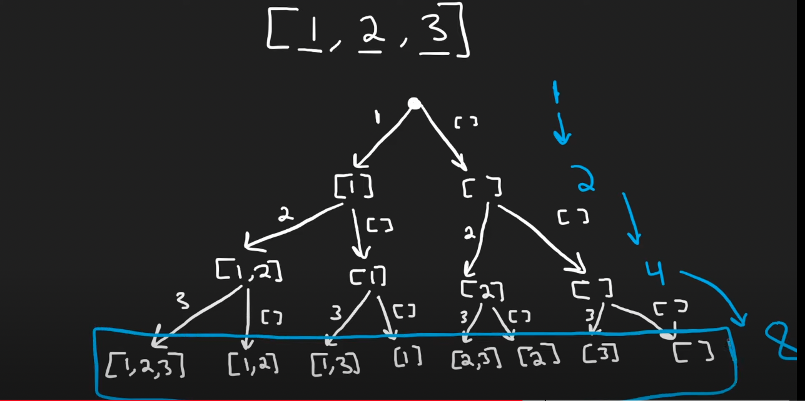

# 77. Combinations
典型的backtrack题
``` python
class Solution(object):
    def combine(self, n, k):
        """
        :type n: int
        :type k: int
        :rtype: List[List[int]]
        """
        res = []
        resList = []
        if k == 0:
            return [[]]
        
        # backtrack是一个递归调用的过程
        def backtracking(start):
            if len(resList) == k: # 只剩k个元素
                temp = resList[:]
                res.append(temp)
            for i in range(start, n + 1):
                resList.append(i)
                backtracking(i + 1)
                resList.pop()
        backtracking(1)
        return res

```

# 46. Permutations 全排列

框架:  
``` python
    res = []
    def backtrack(路径, 选择列表):
        if 满足结束条件:
            res.add(路径)
            return
        for 选择 in 选择列表:
            做选择
            backtrack(路径, 选择列表)
            撤销选择
```
``` python
class Solution:
    def permute(self, nums: List[int]) -> List[List[int]]:
        res = []
        # base case
        if (len(nums) == 1):
            return [nums[:]] # copy of the nums
        
        for i in range(len(nums)):
            n = nums.pop(0) # pop the first element
            perms = self.permute(nums) # 是一个二维数组，be like: [[2,3],[3,2]]
            
            for perm in perms:
                perm.append(n) # be like:[2,3,1] [3,2,1]
                res.append(perm)
            nums.append(n) # 接下来还要用 1, and nums[1,2,3] 变成了 [2,3,1], pop(0)就该pop出2了
        return res
```

# 78. Subsets
 backtrack要我老命  
这个代码适合框架
 

 ```python
class Solution(object):
    def subsets(self, nums):
        """
        :type nums: List[int]
        :rtype: List[List[int]]
        """     
        res, tmp = [], []
        
        def generate(nums, n):
            res.append(tmp[:])
            
            if n == len(nums):
                return 
            for i in range(n, len(nums)):
                tmp.append(nums[i])
                n += 1
                generate(nums, n)
                tmp.pop()
                
        generate(nums, 0)
        return res

 ```