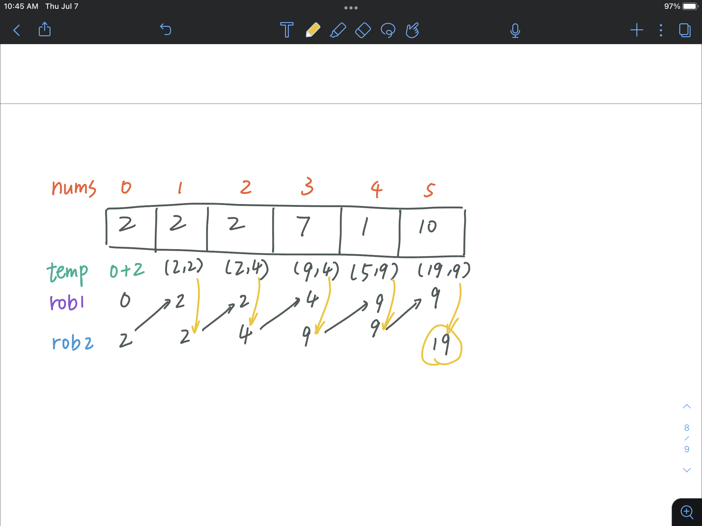
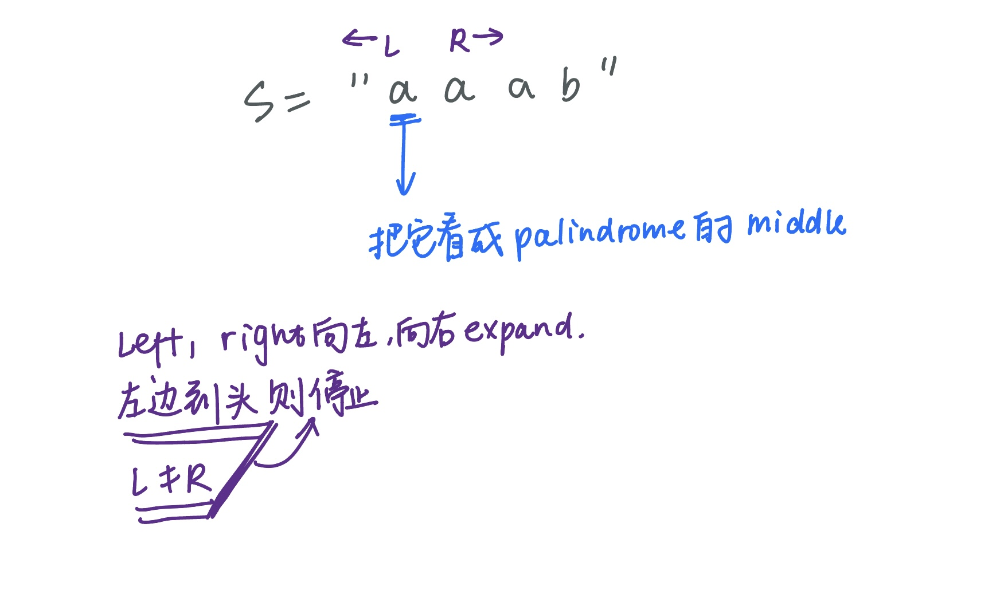

# 746. Min Cost Climbing Stairs
最精彩的一步是在cost后面加了个0，方便计算
[20, 1, 3] 0
``` python
class Solution:
    def minCostClimbingStairs(self, cost: List[int]) -> int:
        cost.append(0)
        
        for i in range(len(cost) - 3, -1, -1):
            cost[i] += min(cost[i+1], cost[i+2])
        
        return min(cost[0], cost[1])
        

```

# 198. House robber
- 不能有连着的两个房子
- 求最大金额
- [2,7,9,3,1] output = 2+9+1 = 12
  
思路：  
- 用dp
- [2,2,2,7,1,10]如果是这种情况[2,7,10] = 19

*与爬楼梯不同的是，每一步是2 or more*

maintain the last two values that we can rob from  
[rob1, rob2, n, n+1, n+2 ...]

``` python
class Solution:
    def rob(self, nums: List[int]) -> int:
        #In this problem, we need to maintain the last two values that we can rob from..
        # Let's called rob1, rob2. 
        # [rob1, rob2, n, n+1, n+2...]
        # We will compare the value of (rob1+n) with rob2, which means we take the current value or not
        # update rob1 and rob2: temp = max(rob1+n, rob2), rob1 = rob2, rob2 = temp (move backward..)
        
        rob1, rob2 = 0,0
        
        for n in nums:
            temp = max(rob1+n, rob2)
            rob1 = rob2
            rob2 = temp
        return rob2
```
记得rob2保存的是最后的结果!!  
图片模拟过程:  


# 213 house robber-2
区别是: 所有的房子是一个circle  
继续沿用rob1的方法，我们比较nums[0], 除去数组中第一个和除去最后一个的结果, 取最大
``` python
class Solution:
    def rob(self, nums: List[int]) -> int:
        return max(nums[0], self.helper(nums[1:]), self.helper(nums[:-1]))
        
    def helper(self, nums):
        rob1, rob2 = 0,0

        for n in nums:
            temp = max(rob2, rob1+n)
            rob1 = rob2
            rob2 = temp
        return rob2
```

# 647 Palindromic Substrings
broute force: O(n^3)   
For each single element, find all the substring which started at this element O(n^2), and then to determine whether it is palindrome O(n).  

O(n^2) solution:  


``` python
class Solution:
    def countSubstrings(self, s: str) -> int:
        res = 0
        for i in range(len(s)):
            # odd
            res += self.helperCount(s, i, i)
            # even
            res += self.helperCount(s, i, i+1)
        return res

    # count the palindrome with left and right pointer started from the middle
    def helperCount(self, s, l, r):
        res = 0
        while l>=0 and r<len(s) and s[l] == s[r]:
            res += 1
            l -= 1
            r += 1
        return res
```
Why odd and even?  
因为单独的a算是一个回文，所以我们初始化的时候，l和r是相等的，都是0，然后分别向左边和右边扩张。但是这样会损失even长度的回文串..  

"a a a b", for example, we miss the first two "aa", because the l will reach the left bound.(l = 0, r = 0)

# 91.Decode ways
broute force: O(2^n)


O(n) solution(recurcive):  
Every decision: have 1 level branch  
``` python
class Solution:
    def numDecodings(self, s: str) -> int:
        # memorization
        dp = {len(s) : 1}
        
        def dfs(i):
            if i in dp:
                return dp[i]
            if s[i] == "0":
                return 0
            res = dfs(i+1)
            if(i+1 < len(s) and (s[i] == "1" or s[i] == "2" and s[i+1] in "0123456")):
                res += dfs(i+2)
            dp[i] = res
            return res
        return dfs(0)
```

``` python
 # Dynamic Programming
        dp = { len(s) : 1 } # base case
        for i in range(len(s) - 1, -1, -1):
            if s[i] == "0":
                dp[i] = 0
            else:
                dp[i] = dp[i + 1]

            if (i + 1 < len(s) and (s[i] == "1" or 
                 s[i] == "2" and s[i + 1] in "0123456")):
                dp[i] += dp[i + 2]
        return dp[0]
```

# 322.coin chaning

``` python
class Solution:
    def coinChange(self, coins: List[int], amount: int) -> int:
        
        dp = [amount+1]*(amount+1) # amount+1 or infinity okay!
        dp[0] = 0
        
        for a in range(1, amount + 1): # every amount
            for i in coins: # coins
                if a - i >= 0:
                    dp[a] = min(dp[a], 1 + dp[a - i]) #update the minimum coins of dp[a]
        return dp[amount] if dp[amount] != amount + 1 else -1

```

# 152. Maximum Product Subarray
注意:  subarray要是连续的  
我们只需要在维护一个局部最大的同时，在维护一个局部最小，这样如果下一个元素遇到负数时，就有可能与这个最小相乘得到当前最大的乘积

In this problem, we would use two variables to maintain the curMax and curMin, because  
For arrays that contain all positive numbers, wre just use a curMax to maintain the max value, but in an array that contains all negative values, we will get a larger number as well for cases which is one negative number multiply by another negative number, so we need a curMin to maintain the minimum number.  
For example, (-3) * (-4) = 12!  
One edge case os that we don't want to handle 0 case, because it will kill our products.  
So we are going to iterate through every single number in our input array, and keep updating the curMax and curMin.  
updating curMax: max(curMax, curMin, n)  
updating curMin: min(curMax, curMin, n) 

``` python
class Solution:
    def maxProduct(self, nums: List[int]) -> int:
        # maintaining two values:curMax, curMin
        # Edge case: 0, we don't wanna handle this edge case because this gonna kill our product
        curMax = 1
        curMin = 1 # neutral value
        result = max(nums)
        for n in nums:
            tmp = curMax
            curMax = max(curMax * n, curMin * n, n)
            curMin = min(tmp * n, curMin * n, n)
            result = max(result, curMax)
        return result
```