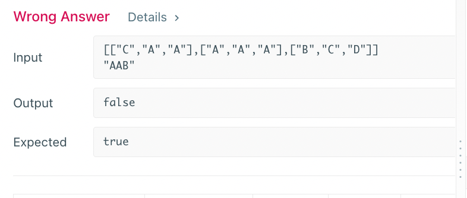

# 200. Number of Islands

### BFS

- 用islands来存岛屿的数量
- 用q来表示队列
- 用visited（set）来存哪些点被visit过

``` python
class Solution(object):
    def numIslands(self, grid):
        """
        :type grid: List[List[str]]
        :rtype: int
        """
        # to see if the grid exists
        if not grid:
            return 0
        visited = set()
        islands = 0
        
         # implement bfs
        def bfs(r, c):
            q = deque()
            visited.add((r, c))
            q.append((r, c))
            directions = [[-1,0], [1,0], [0,-1], [0,1]]
            while q:
                row, col = q.popleft()
                for dr, dc in directions:
                    r = row + dr
                    c = col + dc
                    
                    if (r,c) not in visited and r in range(len(grid)) and c in range(len(grid[0])) and grid[r][c] == '1':
                        q.append((r,c))
                        visited.add((r,c))
        
        # for each node in grid, if not visited, do bfs
        for i in range(len(grid)):
            for j in range(len(grid[0])):
                if grid[i][j] == '1' and (i,j) not in visited:
                    bfs(i,j)
                    islands += 1 # mark the island, and explore all its ajascent nodes by using bfs search
                  
        return islands
    
       

```

# 133.Clone Graph

- Use hashMap to see if we have already added(copy) the node 用hashmap来储存哪些node已经被复制过了
- If the node is not in the hashMap, we copy it and add all it's neighbors recursively(dfs),(treat each neighbor as 'node', to find its neighbors...) 如果这个节点没有被复制过，那么加入这个节点，然后对待他所有的邻居像对待他一样，recursively！

``` python
class Solution(object):
    def cloneGraph(self, node):
        """
        :type node: Node
        :rtype: Node
        """
        oldToNew = {}
        
        def dfs_clone(node):
            if node in oldToNew:
                return oldToNew[node]
            
            copy = Node(node.val)
            oldToNew[node] = copy
            for nei in node.neighbors:
                copy.neighbors.append(dfs_clone(nei))
            return copy
        
        return dfs_clone(node) if node else None
            

```

# 695. Max Area of Island
[dfs]  

``` python
class Solution(object):
    def maxAreaOfIsland(self, grid):
        """
        :type grid: List[List[int]]
        :rtype: int
        """
        # initializing
        rows = len(grid)
        cols = len(grid[0])
        visited = set() # hash map
        
        # dfs defination
        # edge cases -> mark visited -> recursively dfs
        def dfs(row, col):
            if(row < 0 or row == rows or col < 0 or col == cols or grid[row][col] == 0 or (row, col) in visited): # row, col不出界，该点不是小岛, 该点已经被visited
                return 0
            visited.add((row, col))
            return (1 + dfs(row + 1, col) +
                        dfs(row - 1, col) +
                        dfs(row, col + 1) +
                        dfs(row, col - 1))
        
        # traverse all the point of the graph, record max area
        area = 0
        for row in range(rows):
            for col in range(cols):
                area = max(area, dfs(row, col))
        return area
```

# 417. Pacific Atlantic Water Flow
他不是判断哪些岛能够通向海，而是看海能通向哪些海岛，这样做的好处是：

```python
class Solution(object):
    def pacificAtlantic(self, heights):
        """
        :type heights: List[List[int]]
        :rtype: List[List[int]]
        """
        
        # initializing
        ROWS = len(heights)
        COLS = len(heights[0])
        pac, atl = set(), set()
        # define dfs
        def dfs(row, col, visited, prevHeight): # visited 便于复用，直接传参数
            # meet the requirements
            if(row < 0 or row == ROWS or col < 0 or col == COLS or (row, col) in visited or heights[row][col] < prevHeight):
                return 
            # update visited
            visited.add((row, col))
            # dfs recursive
            dfs(row + 1, col, visited, heights[row][col])
            dfs(row - 1, col, visited, heights[row][col])
            dfs(row, col + 1, visited, heights[row][col])
            dfs(row, col - 1, visited, heights[row][col])
        
        # first col and first col - pacific ocean
        for c in range(COLS):
            dfs(0, c, pac, heights[0][c])
            dfs(ROWS - 1, c, atl, heights[ROWS - 1][c])
        # last row and last col - atlantic ocean
        for r in range(ROWS):
            dfs(r, 0, pac, heights[r][0])
            dfs(r, COLS - 1, atl, heights[r][COLS - 1])
        # traverse all the points to see if it is in both pac and atlantic ocean..
        res = []
        for r in range(ROWS):
            for c in range(COLS):
                if(r, c) in pac and (r, c) in atl:
                    res.append((r, c))
        return res

```

# 130. Surrounded Regions
``` python
class Solution(object):
    def solve(self, board):
        """
        :type board: List[List[str]]
        :rtype: None Do not return anything, modify board in-place instead.
        """
        ROWS = len(board)
        COLS = len(board[0])
        def captureDFS(r, c):
            if (r < 0 or c < 0 or r == ROWS or c == COLS or board[r][c] != "O"):
                return
            board[r][c] = "T" # replace it to a new symbol
            captureDFS(r + 1, c)
            captureDFS(r - 1, c)
            captureDFS(r, c + 1)
            captureDFS(r, c - 1)
        
        for r in range(ROWS):
            for c in range(COLS):
                if ((board[r][c] == "O") and (r in [0, ROWS - 1] or c in [0, COLS - 1])): # 这个在python中很好用! r in [0, rows] 就是看r是否在这个集合里
                    captureDFS(r, c)
        for r in range(ROWS):
            for c in range(COLS):
                if board[r][c] == "O":
                    board[r][c] = "X"
        for r in range(ROWS):
            for c in range(COLS):
                if board[r][c] == "T":
                    board[r][c] = "O"
                    
    
```

# 79. Word Search

``` python
class Solution(object):
    def exist(self, board, word):
        """
        :type board: List[List[str]]
        :type word: str
        :rtype: bool
        """
        # dfs
        row = len(board)
        col = len(board[0])
        path = set()
        def dfs(r, c, i):
            if i == len(word):
                return True
            if(r < 0 or c < 0 or r >= row or c >= col or board[r][c] != word[i] or (r, c) in path): # 6!
                return False
            path.add((r, c))
            res =(
                dfs(r + 1, c, i + 1) or
                dfs(r - 1, c, i + 1) or
                dfs(r, c + 1, i + 1) or
                dfs(r, c - 1, i + 1)
            )
            path.remove((r, c)) # 注意这里  为什么要remove？
            return res
        for r in range(row):
            for c in range(col):
                if dfs(r, c, 0):
                    return True
        return False

```
如果把remove去掉, 出现如下:
  
我想着应该是以该点为起点进行dfs的时候，如果不存在一条路径，那么要把这个点从path中删除，可以当作别的路径的中间点来用，所以把它remove掉，这也是在图里寻找路径（有序）于岛屿（无序）的区别