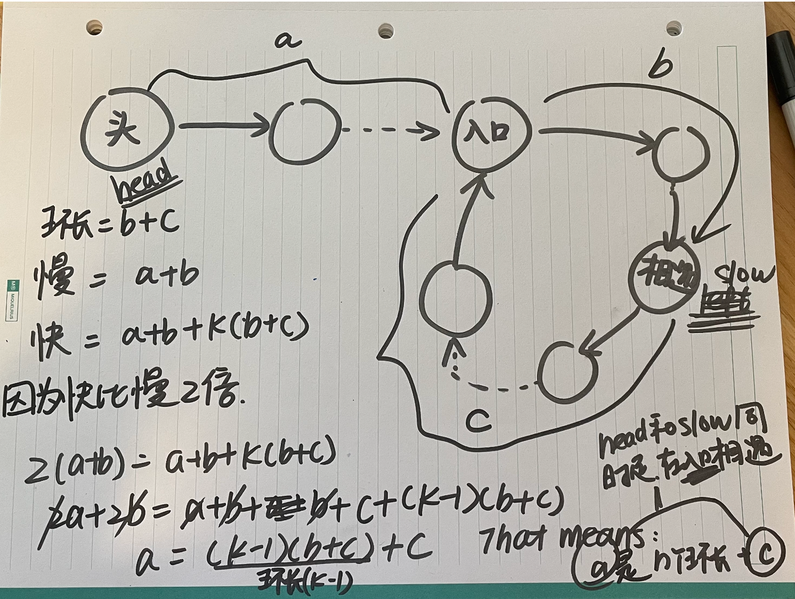

# 142. Linked List Cycle II

# Given a linked list, return the node where the cycle begins. If there is no cycle, return null.

``` python

# Definition for singly-linked list.
# class ListNode:
#     def __init__(self, x):
#         self.val = x
#         self.next = None

class Solution:
    def detectCycle(self, head: Optional[ListNode]) -> Optional[ListNode]:
        slow = head
        fast = head

        while fast and fast.next:
            slow = slow.next
            fast = fast.next.next

            if fast is slow: # fast和 slow 相遇
                while slow is not head: # 一直移动 让 head 和 slow 在入口相遇
                    slow = slow.next
                    head = head.next
                return slow
        return None
# Find Start of Cycle: Once the slow and fast pointers meet, reset one of the pointers to the head of the linked list. Move both pointers one step at a time. They will eventually meet at the start of the cycle.
# 弗洛伊德圈
# a=(k−1)(b+c)+c

```

