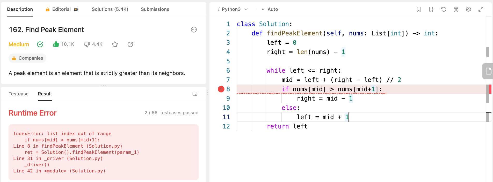

# 162. Find Peak Element

https://leetcode.com/problems/find-peak-element/solutions/788474/general-binary-search-thought-process-4-templates/?envType=study-plan-v2&envId=leetcode-75

``` python
class Solution:
    def findPeakElement(self, nums: List[int]) -> int:
        left = 0
        right = len(nums) - 1

        while left < right:
            mid = left + (right - left) // 2
            if nums[mid] > nums[mid+1]:
                right = mid
            else:
                left = mid + 1
        return left
```
Finally, when the left and right pointers converge (left == right), you've found a peak element.
