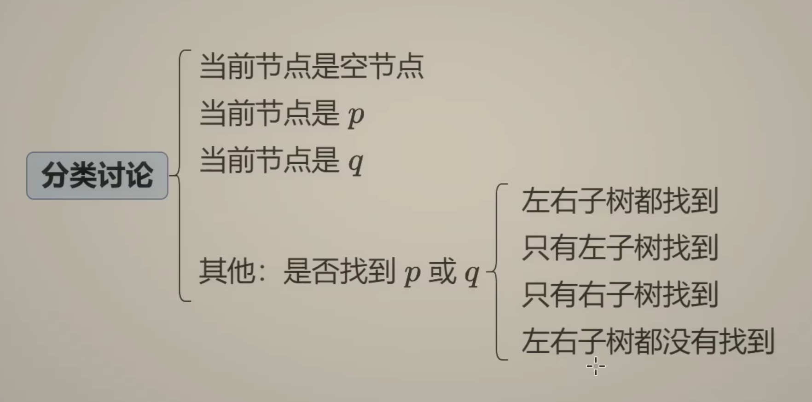
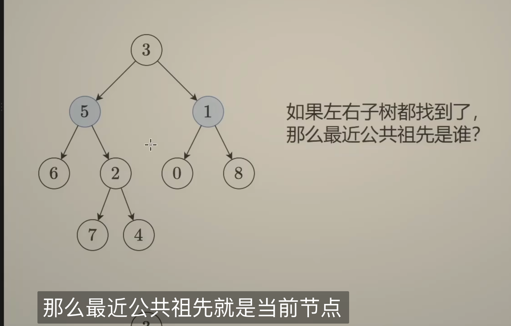
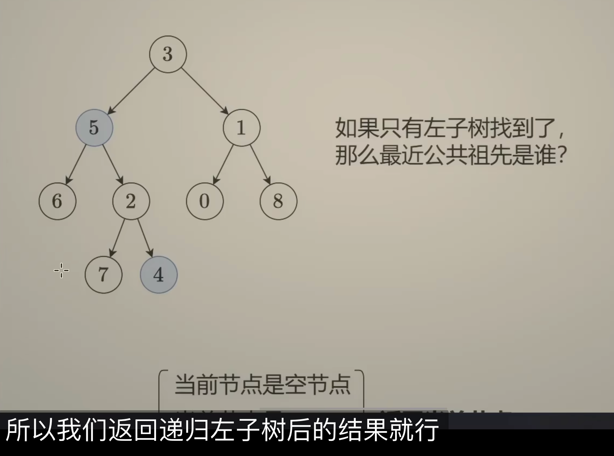
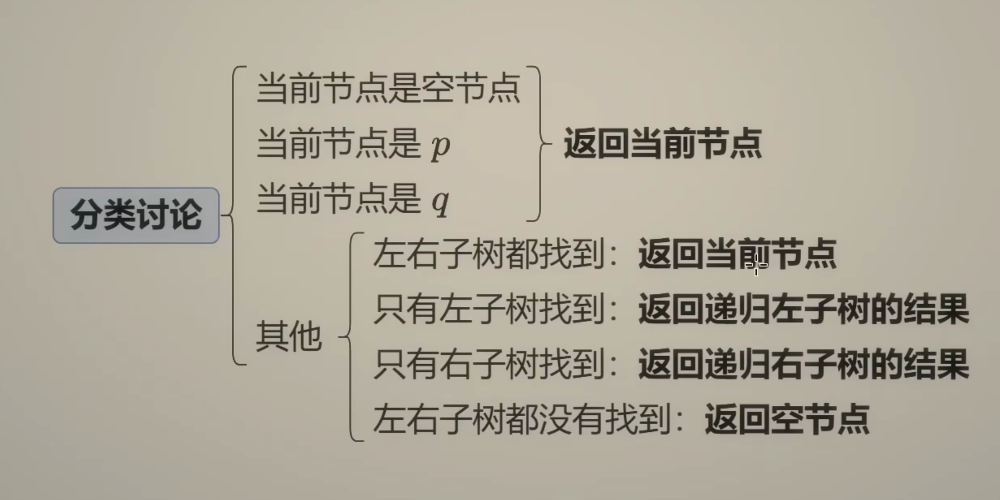

# Lowest Common Ancestor Of A Binary Tree

1. If the current node(root) is one of the two nodes, then it is the LCA.
2. If the current node is NOT one of the current node, then we check its left and right subtree, if one node is in the left  subtree and the other is in the right subtree, then the current node is the LCA.
3. If both nodes are in the same subtree, then the LCA is in the left subtree when they are in the left subtree, vice versa.

``` python
# Definition for a binary tree node.
# class TreeNode:
#     def __init__(self, x):
#         self.val = x
#         self.left = None
#         self.right = None

class Solution:
    def lowestCommonAncestor(self, root: 'TreeNode', p: 'TreeNode', q: 'TreeNode') -> 'TreeNode':
        if not root:
            return None
        if root == p or root == q:
            return root
        else:
            left = self.lowestCommonAncestor(root.left, p, q)
            right = self.lowestCommonAncestor(root.right, p, q)

        # if both left and right are non-null node, it means we found the split node, then the current node is the ansestor
        if left and right:
            return root
        else:
            return left if left else right

```






