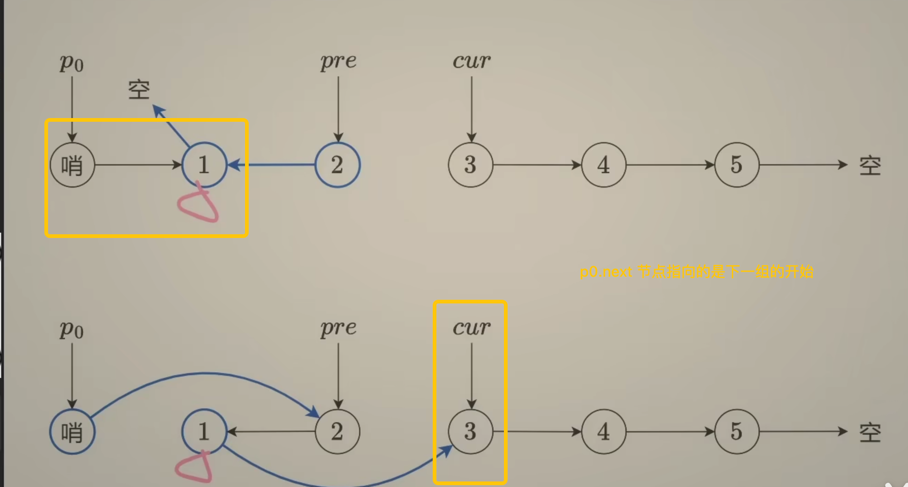
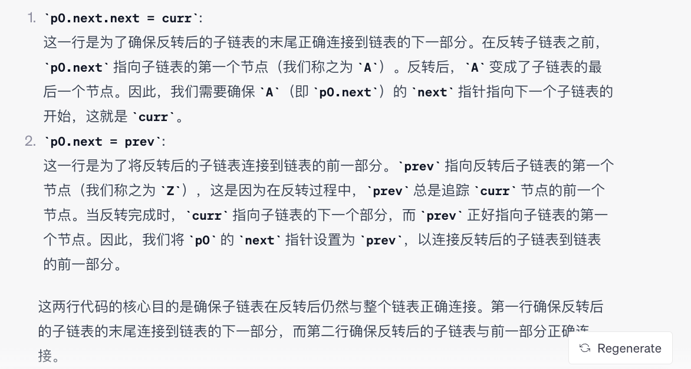

# 25. Reverse Nodes in k-Group



``` python
# Definition for singly-linked list.
# class ListNode:
#     def __init__(self, val=0, next=None):
#         self.val = val
#         self.next = next
class Solution:
    def reverseKGroup(self, head: Optional[ListNode], k: int) -> Optional[ListNode]:

        # 翻转之前先判断节点个数 >= k 可以翻转
        # 更新 p0

        # compute the length of the linked list
        n = 0
        curr = head
        while curr:
            n += 1
            curr = curr.next

        # reverse linked list
        dummy = ListNode(next = head)
        p0 = dummy
        prev = None
        curr = p0.next

        while n >= k:
            n -= k
            for _ in range(k):
                nxt = curr.next
                curr.next = prev
                prev = curr
                curr = nxt

            # Why? 为了移动指针
            nxt = p0.next # 因为 p0.next 将要被更改，先保存一下
            # 之后两句没有改变链表结构，只是将 p0 移动到下一组将要被翻转的节点的起始点
            p0.next.next = curr # 注意顺序
            p0.next = prev
            p0 = nxt # p0 移动到下一组将要被翻转的节点的起始点
        return dummy.next
```


nxt = p0.next:
这行代码保存了将要被反转的 k 个节点的当前起始点。反转 k 个节点后，这个节点将是反转子列表的最后一个节点。
p0.next.next = curr:

反转 k 个节点后，我们需要将反转子列表的最后一个节点连接到剩余的列表上。此时，curr 指向剩余列表（在反转的 k 个节点之后）的第一个节点。
p0.next 是反转子列表的第一个节点（反转后成为最后一个节点）。因此，p0.next.next 指的是反转子列表中最后一个节点的 next 指针。我们将此指针更新为 curr，以将反转的子列表连接到剩余的列表。
p0.next = prev:

这行代码将前一个子列表（或对于第一个子列表的虚拟节点）连接到反转子列表的第一个节点。请记住，反转后，k 个节点的最后一个节点变成了第一个，而 prev 指向这个节点。
p0 = nxt:

这行代码将 p0 移动到反转的 k 个节点的末尾（在反转之前是 k 个节点的开始）。这为下一次迭代准备了 p0，在下一次迭代中，我们将反转下一个 k 个节点。
return dummy.next:

这行代码返回修改后的链表的新头部。请记住，dummy 是我们在开始时创建的一个占位节点，其 next 指针设置为原始头部。经过所有操作后，dummy.next 将指向列表的新头部。