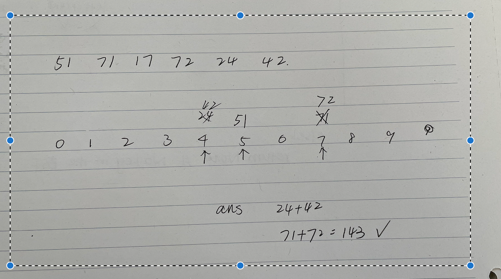

# 2815. Max Pair Sum in an Array



``` python
class Solution:
    def maxSum(self, nums: List[int]) -> int:
        ans = -1
        max_val  = [-inf] * 10 # The index represents the digits, and the array stores the corresponding value

        for v in nums:
            max_d = max(map(int, str(v))) # find the largest digit 快捷写法
            ans = max(ans, v + max_val[max_d]) # Record the SUM of current value(maximum as well)
            max_val[max_d] = max(max_val[max_d], v) # Update含有当前下标digit对应的最大数值
        return ans
```

O(nlogU) U is the maximum value of nums
相当于枚举每个数位