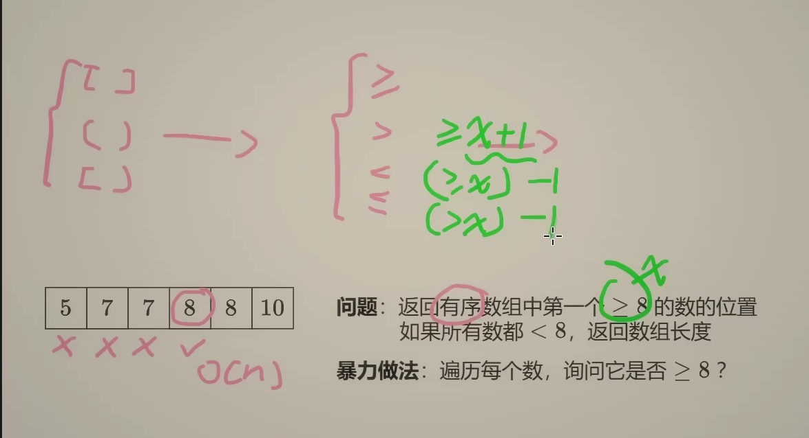

# 34. Find First and Last Position of Element in Sorted Array
# https://leetcode.com/problems/find-first-and-last-position-of-element-in-sorted-array/



``` python
class Solution:
    def searchRange(self, nums: List[int], target: int) -> List[int]:
        start = self.lower_bound(nums, target)
        if start == len(nums) or nums[start] != target:
            return [-1, -1]
        end = self.lower_bound(nums, target + 1) - 1
        return [start, end]
    def lower_bound(self, nums, target):
            left, right = 0, len(nums) - 1

            while left <= right:
                mid = (left + right) // 2
                if nums[mid] < target:
                    left += 1
                else:
                    right -= 1
            return left
```