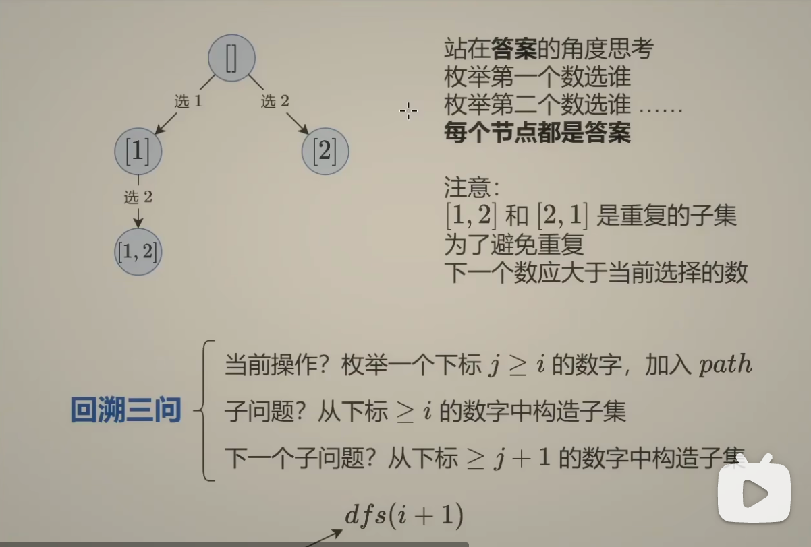
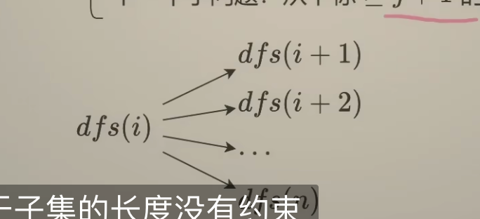
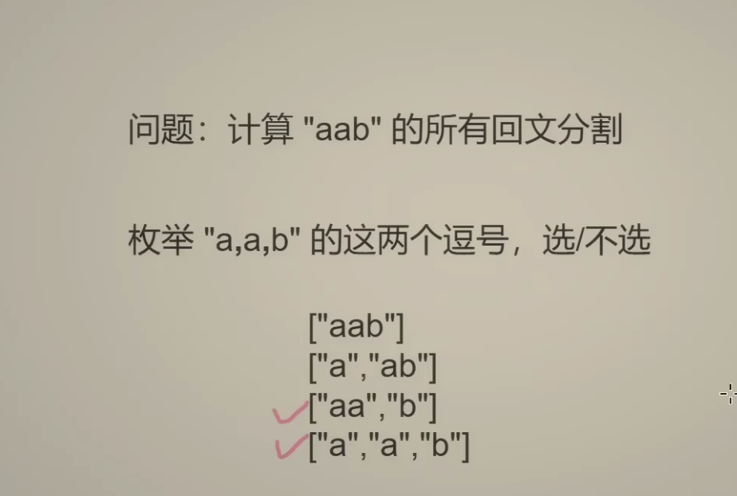
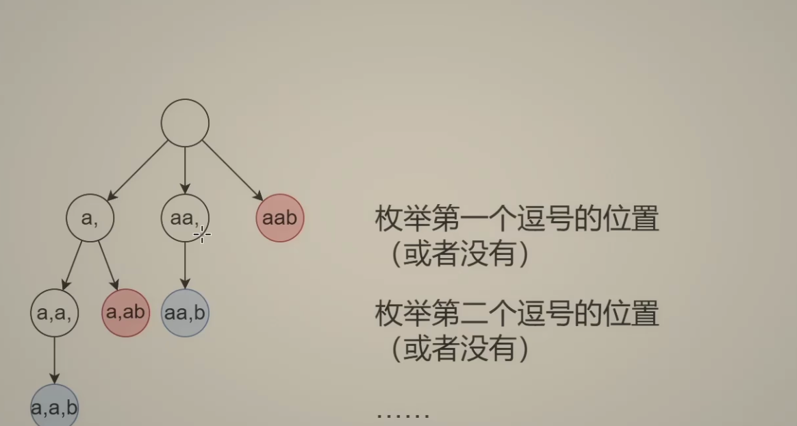

# 78. Subsets

## Solution-1

``` python

class Solution:
    def subsets(self, nums: List[int]) -> List[List[int]]:
        ans = []
        path = [] # store the current subset
        n = len(nums)

        def dfs(i):
            if i == n:
                ans.append(path.copy()) # 路径是全局变量，会变化
                return

            # 不添加第i个元素,直接递归i+1
            dfs(i+1)

            # 添加第i个元素
            path.append(nums[i]) # 加入路径
            dfs(i+1) # 递归
            path.pop()# 恢复现场，因为是在路径后面添加元素，所以递归之前是什么样，递归之后也应该是什么样，递归结束后，路径上就不包含nums[i]了

        dfs(0)
        return ans

# (n*2^n)
# O(n)
```

## Solution-2
``` python
class Solution:
    def subsets(self, nums: List[int]) -> List[List[int]]:
        # 递归到的每个节点都是答案
        ans = []
        path = [] # store the current subset
        n = len(nums)

        def dfs(i):
            ans.append(path.copy())
            if i == n:
                return
            for j in range(i, n):
                path.append(nums[j])
                dfs(j+1)
                path.pop()

        dfs(0)
        return ans

# (n*2^n)
# O(n)
```



# 131. Palindrome Partitioning
相似的题
``` python
class Solution:
    def partition(self, s: str) -> List[List[str]]:
        # 可以看成选不选逗号（子集型回溯）
        # 枚举逗号的位置也相当于枚举回文子串结束的位置
        ans = []
        path = []
        n = len(s)

        def dfs(i):
            if i == n:
                ans.append(path.copy()) # 没有每次递归都添加答案，因为每个字母都需要在答案中，等到分割完了再添加答案
                return
            for j in range(i, n):
                # 如何判断回文，j是作为子串结束的位置
                t = s[i:j+1]
                if t == t[::-1]:
                    path.append(t)
                    dfs(j+1)
                    path.pop()
        dfs(0)
        return ans
```

