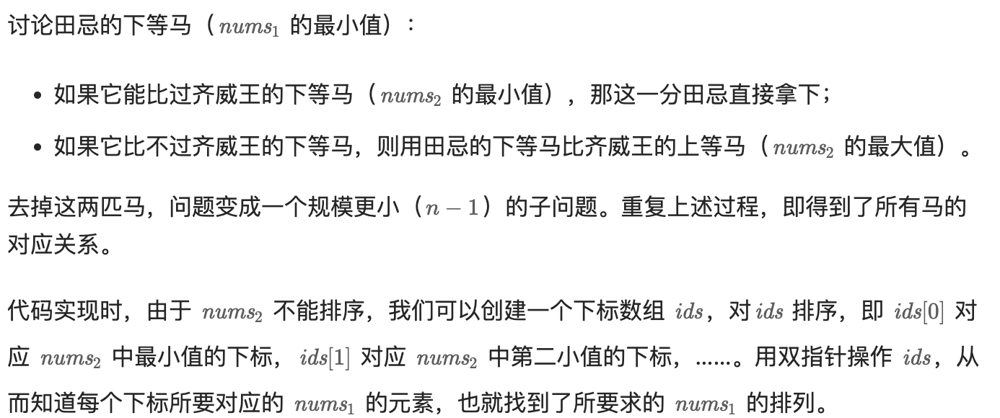
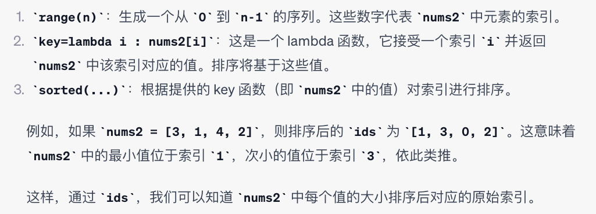

# 870. Advantage Shuffle

### 田忌赛马

``` python
class Solution:
    def advantageCount(self, nums1: List[int], nums2: List[int]) -> List[int]:
        n = len(nums1)
        res = [0] * n # nums1 and nums2 has same length

        nums1.sort()

        ids = sorted(range(n), key=lambda i : nums2[i])
        # ids[0]对应nums2中最小值的下标，ids[1]对应nums2中倒数第二小的下标
        left, right = 0, n-1
        for x in nums1:
            if x > nums2[ids[left]]:
                res[ids[left]] = x # 用下等马和下等马比较，res下标和nums2保持一致
                left += 1

            else:
                res[ids[right]] = x # 用下等马比上等马
                right -= 1
        return res
```



#### lambda function


``` python
ids = sorted(range(n), key=lambda i : nums2[i])
```

