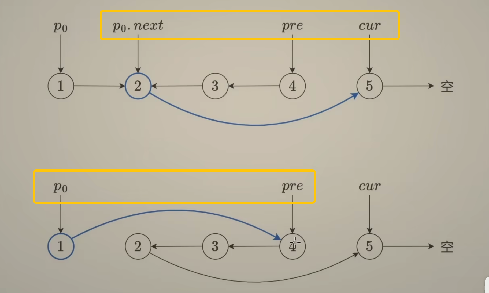

# 92. Reverse Linked List II



``` python
# Definition for singly-linked list.
# class ListNode:
#     def __init__(self, val=0, next=None):
#         self.val = val
#         self.next = next
class Solution:
    def reverseBetween(self, head: Optional[ListNode], left: int, right: int) -> Optional[ListNode]:
        # left = 1时，p0指向谁? dummy head!

        dummy = ListNode(next = head)
        p0 = dummy

        # Move p0 to the node before the left node
        for _ in range(left - 1):
            p0 = p0.next

        prev = None
        curr = p0.next

        # Reverse Linked List I
        for _ in range(right - left + 1):
            nxt = curr.next
            curr.next = prev
            prev = curr
            curr = nxt
        p0.next.next = curr
        p0.next = prev

        return dummy.next
```