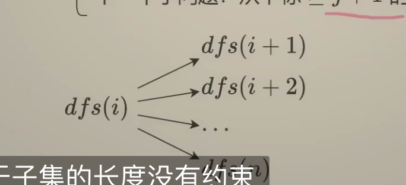

# 78. Subsets

## Solution-1

```python

class Solution:
    def subsets(self, nums: List[int]) -> List[List[int]]:
        ans = []
        path = [] # store the current subset
        n = len(nums)

        def dfs(i):
            if i == n:
                ans.append(path.copy()) # 路径是全局变量，会变化
                return

            # 不添加第i个元素,直接递归i+1
            dfs(i+1)

            # 添加第i个元素
            path.append(nums[i]) # 加入路径
            dfs(i+1) # 递归
            path.pop()# 恢复现场，因为是在路径后面添加元素，所以递归之前是什么样，递归之后也应该是什么样，递归结束后，路径上就不包含nums[i]了

        dfs(0)
        return ans

# (n*2^n)
# O(n)
```

## Solution-2

```python
class Solution:
    def subsets(self, nums: List[int]) -> List[List[int]]:
        # 递归到的每个节点都是答案
        ans = []
        path = [] # store the current subset
        n = len(nums)

        def dfs(i):
            ans.append(path.copy())
            if i == n:
                return
            for j in range(i, n):
                path.append(nums[j])
                dfs(j+1)
                path.pop()

        dfs(0)
        return ans

# (n*2^n)
# O(n)
```




# 131. Palindrome Partitioning

相似的题

```python
class Solution:
    def partition(self, s: str) -> List[List[str]]:
        # 可以看成选不选逗号（子集型回溯）
        # 枚举逗号的位置也相当于枚举回文子串结束的位置
        ans = []
        path = []
        n = len(s)

        def dfs(i):
            if i == n:
                ans.append(path.copy()) # 没有每次递归都添加答案，因为每个字母都需要在答案中，等到分割完了再添加答案
                return
            for j in range(i, n):
                # 如何判断回文，j是作为子串结束的位置
                t = s[i:j+1]
                if t == t[::-1]:
                    path.append(t)
                    dfs(j+1)
                    path.pop()
        dfs(0)
        return ans
```


# 784. Letter Case Permutation

```python
class Solution:
    def letterCasePermutation(self, s: str) -> List[str]:
        path = list(s) # 分割出字符
        ans = []
        n = len(s)

        def dfs(i):
            ans.append("".join(path))
            for j in range(i,n):
                if 'a'<=s[j]<='z' or 'A'<=s[j]<='Z':
                    path[j] = path[j].swapcase()
                    dfs(j+1)
                    path[j] = path[j].swapcase()
        dfs(0)
        return ans
```

or we could use solution-1

```python
class Solution:
    def letterCasePermutation(self, s: str) -> List[str]:
        path = list(s) # 分割出字符
        ans = []
        n = len(s)

        def dfs(i):
            if i == n:
                ans.append("".join(path)) # 只需要最后结果
                return

            dfs(i+1)
            if 'a'<=s[i]<='z' or 'A'<=s[i]<='Z':
                path[i] = path[i].swapcase()
                dfs(i+1)
                path[i] = path[i].swapcase()
        dfs(0)
        return ans
```

# 216. Combination Sum III

```python
class Solution:
    def combinationSum3(self, k: int, n: int) -> List[List[int]]:
        ans = []
        path = []

        def dfs(i, target):
            rest = k - len(path)

            # Reduce branch
            if target<0 or target>(i*2-rest+1)*rest//2:
                return

            if len(path) == k:
                ans.append(path.copy())
                return
            # traverse the rest list, 枚举下一个数选哪一个
            for j in range(i, rest-1, -1):
                path.append(j)
                dfs(j-1, target-j)
                path.pop()

        dfs(9,n)
        return ans
```

用选或者不选

```python
class Solution:
    def combinationSum3(self, k: int, n: int) -> List[List[int]]:
        ans = []
        path = []

        def dfs(i, target):
            rest = k - len(path)

            # Reduce branch
            if target<0 or target>(i*2-rest+1)*rest//2:
                return

            if len(path) == k:
                ans.append(path.copy())
                return
            # 不选
            if i>rest:
                dfs(i-1, target)

            path.append(i)
            dfs(i-1, target-i)
            path.pop()

        dfs(9,n)
        return ans
```

# 22. Generate Parentheses

```python
class Solution:
    def generateParenthesis(self, n: int) -> List[str]:
        m = n * 2
        ans = []
        path = [''] * m

        def dfs(i, left):
            # edge case
            if i == m:
                ans.append(''.join(path))
                return
            # 第i个位置是左括号还是又括号?
            # 构造字符串大于等于i+1的部分

            # 需要选左括号，left<n就可以选
            if left< n:
                path[i] = '('
                dfs(i+1, left+1)

            # 左右括号个数之和等于i，如果右括号个数小于左括号，我们可以再选右括号
            if i - left < left:
                path[i] = ')'
                dfs(i+1, left)
        dfs(0,0)
        return ans

```

# 46. Permutations

```python
class Solution:
    def permute(self, nums: List[int]) -> List[List[int]]:
        n = len(nums)
        ans = []
        path = [0]*n

        def dfs(i, s):
            if i == n:
                ans.append(path.copy())
                return

            for x in s:
                path[i] = x
                dfs(i+1, s-{x})

        dfs(0, set(nums))
        return ans
```


通用做法

```python
class Solution:
    def permute(self, nums: List[int]) -> List[List[int]]:
        # 通用做法
        n = len(nums)
        ans = []
        path = [0]*n
        on_path = [False]*n

        def dfs(i):
            if i == n:
                ans.append(path.copy())
                return
            for j in range(n):
                if not on_path[j]:
                a    path[i] = nums[j]
                    on_path[j] = True
                    dfs(i+1)
                    on_path[j] = False # 恢复现场

        dfs(0)
        return ans
```

