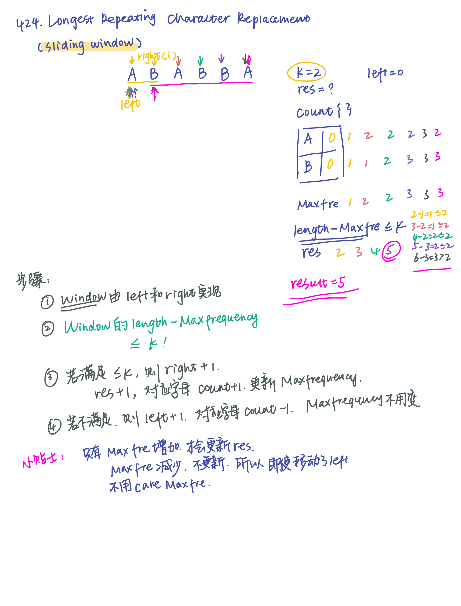

# 424. Longest Repeating Character Replacement
**解题思路**  

*滑动窗口*  
- 使用count（hash）来保存每个字母的出现频率，记录最高的次数
- 使用left，right来实现window，用循环更新right，而left的更新条件是：right-left+1-max_frequency的值大于k，意味着需要被替换的字母数已经超过了规定，我们需要移动left来缩小窗口
- res保留最大的长度


``` python
class Solution:
    def characterReplacement(self, s: str, k: int) -> int:
        count = {}
        res = 0
        left = 0
        max_frequency = 0
        for right in range(len(s)):
            count[s[right]] = count.get(s[right], 0) + 1
            max_frequency = max(max_frequency, count[s[right]])
            
            if(right - left + 1 - max_frequency) > k:
                count[s[right]] -= 1
                left += 1
            
            res = max(res, right - left + 1)
        return res
```        
                