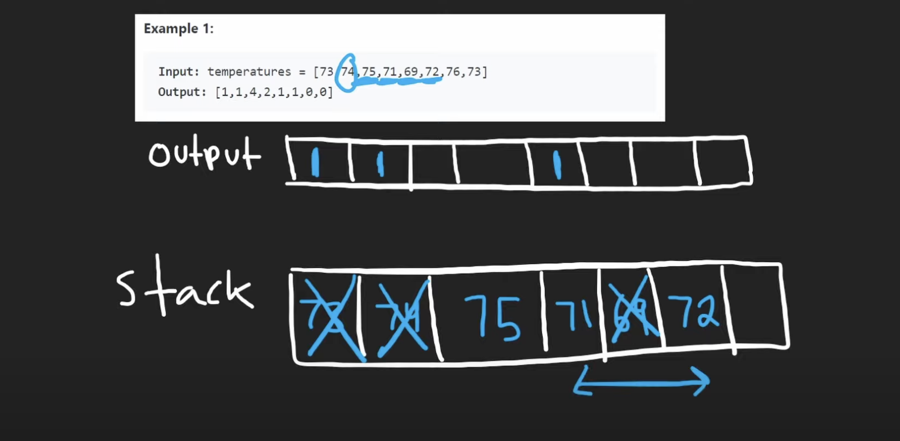

# 739. Daily Temperatures

解题思路：  
**monolistic decreasing stack**


``` python
class Solution:
    def dailyTemperatures(self, temperatures: List[int]) -> List[int]:
        res = [0] * len(temperatures) 
        stack = [] # store pair:(temperature, index)

        # 循环迭代每一个温度
        for i, t in enumerate(temperatures):
            # 栈不为空 and 当前温度大于栈顶（previous）温度
            while stack and t > stack[-1][0]:
                # 记录下标
                stackT, stackIndex = stack.pop()
                res[stackIndex] = i-stackIndex
            # 如果是降温，则把温度和下标加入栈
            stack.append([t,i])
        return res
    
    # stack[-1][0]:我们要栈顶元素，and temperature是每个[temp, index]的第一个元素,所以是0
```
