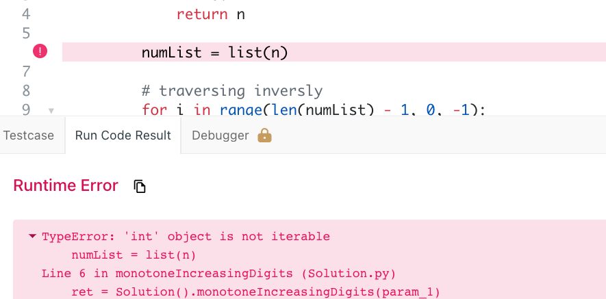
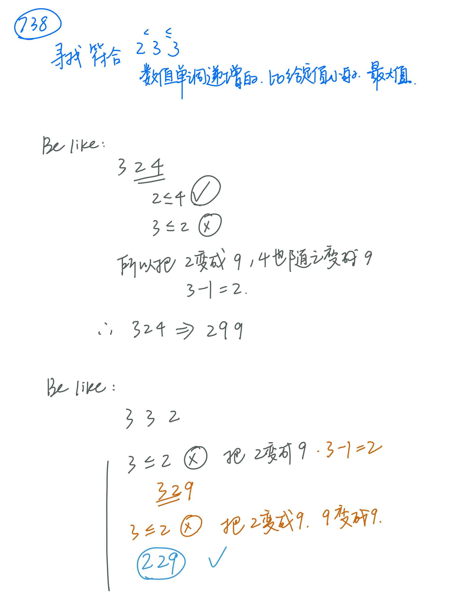
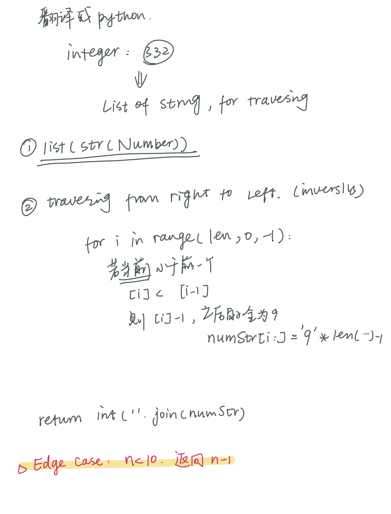
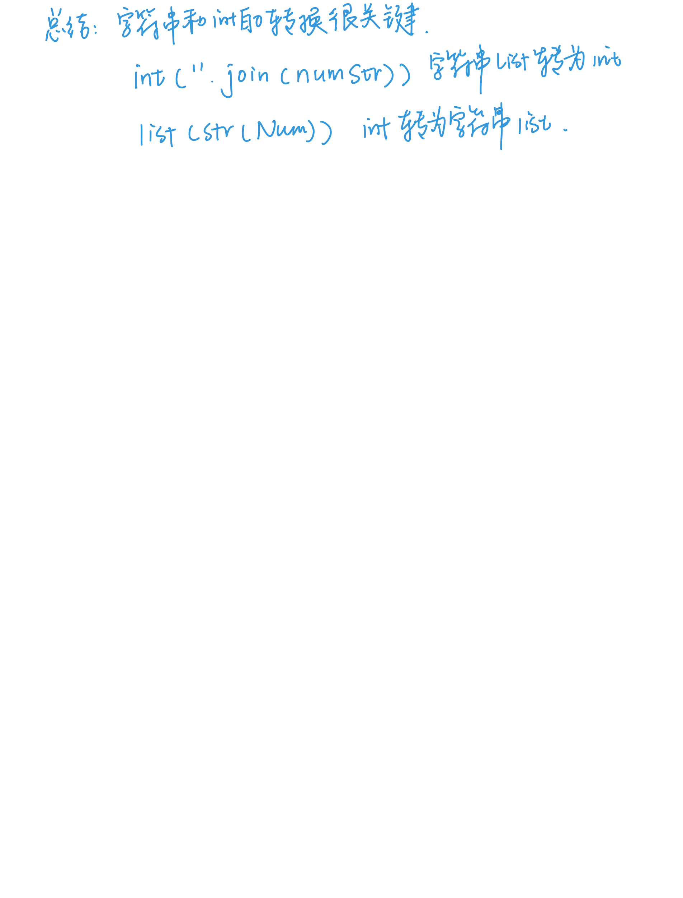

# 738. Monotone Increasing Digits

``` python
class Solution:
    def monotoneIncreasingDigits(self, n: int) -> int:
        if n < 10:
            return n
        
        numList = list(str(n))
        
        # traversing inversly
        for i in range(len(numList) - 1, 0, -1):
            if int(numList[i]) < int(numList[i - 1]):
                numList[i - 1] = str(int(numList[i - 1]) - 1)
                numList[i:] = '9' * (len(numList) - i)
        return int(''.join(numList))

```
* 整数不是可迭代类型，所以要转成字符串

### 解题思路


